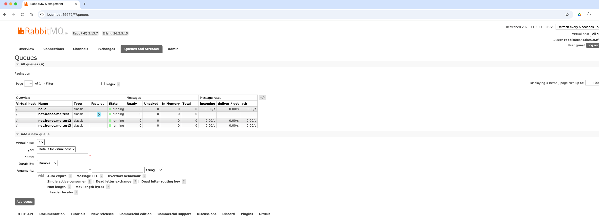
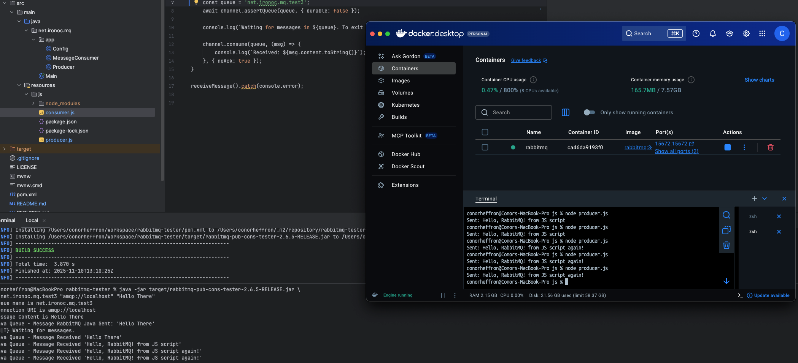

[](https://opensource.org/licenses/Apache-2.0)

[](https://github.com/conorheffron/rabbitmq-tester/actions/workflows/maven.yml)


# About
Tool for testing RabbitMQ instance with sample publisher and consumer of text messages.

# Program Arguments
```
queue-name "rabbit-mq-instance-url" "message-to-send-receive"
```

## Technologies 
 - JDK 17, Spring Boot 4, & Rabbit-MQ 5

---

### Quick Start

#### Run RabbitMQ locally
```shell
docker run -d --name rabbitmq -p 5672:5672 -p 15672:15672 rabbitmq:3-management
```

#### Build Project
```shell
./mvnw clean install
```

#### Run Main Process
```shell
java -jar target/rabbitmq-pub-cons-tester-3.0.3-RELEASE.jar \
  net.ironoc.mq.test3 "amqp://localhost" "Hello There"
```

##### Console Out
```shell
Queue name is net.ironoc.mq.test3
Connection URI is amqp://localhost
Message Content is Hello There
Java Queue - Message RabbitMQ Java Sent: 'Hello There'
{N|T} Waiting for messages.
Java Queue - Message Received 'Hello There'
```

#### Login as guest:guest to verify RabbitMQ instance
```shell
http://localhost:15672/
```



---

#### JS Tool for testing queues in parallel
##### Run Consumer
```shell
cd src/main/resources/js
```
```shell
npm install amqplib
```
```shell
node consumer.js
```

#### Run Producer
```shell
cd src/main/resources/js
```
```shell
node producer.js
```



