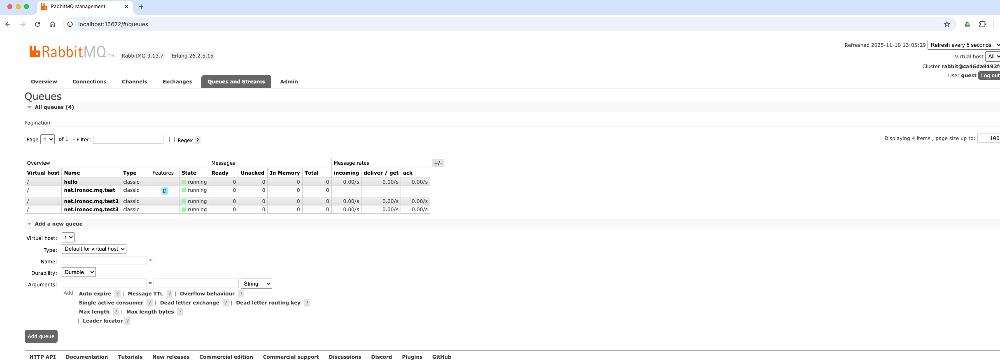
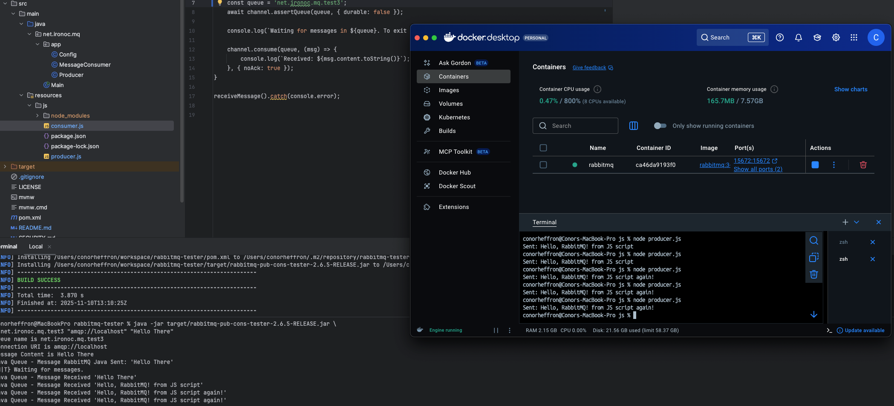

[](https://opensource.org/licenses/Apache-2.0)

[](https://github.com/conorheffron/rabbitmq-tester/actions/workflows/maven.yml)


# About
Tool for testing RabbitMQ instance with sample publisher and consumer of text messages.

# Program Arguments
```
queue-name "rabbit-mq-instance-url" "message-to-send-receive"
```

## Technologies 
 - JDK 17, Spring Boot 4, RabbitMQ Client 5, & RabbitMQ Instance 3

## Project Structure
```shell
src
├── integration-test
│   └── java
│       └── com.ironoc.db.controller
│           ├── CustomErrorControllerIntegrationTest.java
│           └── PersonControllerIntegrationTest.java
├── main
│   ├── java
│   │   └── com
│   │       └── ironoc
│   │           └── db
│   │               ├── App.java
│   │               ├── config
│   │               │   └── IronocDbConfig.java
│   │               ├── controller
│   │               │   ├── CustomErrorController.java
│   │               │   ├── PersonController.java
│   │               │   └── VersionController.java
│   │               ├── dao
│   │               │   └── PersonDao.java
│   │               ├── enums
│   │               │   └── DataSourceKey.java
│   │               ├── model
│   │               │   ├── Employer.java
│   │               │   └── Person.java
│   │               └── service
│   │                   ├── GoogleCloudClient.java
│   │                   ├── GoogleCloudClientImpl.java
│   │                   ├── PersonService.java
│   │                   └── PersonServiceImpl.java
│   ├── META-INF
│   │   └── MANIFEST.MF
│   └── resources
│       ├── application-h2.properties
│       ├── application.properties
│       ├── db
│       │   ├── data-h2.sql
│       │   ├── data-mysql.sql
│       │   └── ddl.sql
│       ├── log4j.xml
│       ├── static
│       │   ├── favicon.ico
│       │   ├── img
│       │   │   └── robot-logo.png
│       │   ├── ironoc-db-banner.txt
│       │   └── style
│       │       └── main.css
│       └── templates
│           ├── add-employee.html
│           ├── edit-person.html
│           ├── employee-list.html
│           ├── error404.html
│           ├── index.html
│           └── navbar.html
└── test
    ├── java
    │   └── com
    │       └── ironoc
    │           └── db
    │               ├── AppTest.java
    │               ├── config
    │               │   └── IronocDbConfigTest.java
    │               ├── controller
    │               │   ├── CustomErrorControllerTest.java
    │               │   ├── PersonControllerTest.java
    │               │   └── VersionControllerTest.java
    │               └── service
    │                   ├── GoogleCloudClientServiceTest.java
    │                   └── PersonServiceTest.java
    └── resources
        └── application.properties
```

---

### Quick Start

#### Run RabbitMQ locally
```shell
docker run -d --name rabbitmq -p 5672:5672 -p 15672:15672 rabbitmq:3-management
```

#### Build Project
```shell
./mvnw clean install
```

#### Run Main Process
```shell
java -jar target/rabbitmq-pub-cons-tester-3.0.5-RELEASE.jar \
  net.ironoc.mq.test3 "amqp://localhost" "Hello There"
```

##### Console Out
```shell
15:46:06.181 [main] INFO net.ironoc.mq.Main -- Queue name is net.ironoc.mq.test3
15:46:06.188 [main] INFO net.ironoc.mq.Main -- Connection URI is amqp://localhost
15:46:06.188 [main] INFO net.ironoc.mq.Main -- Message Content is Hello There
15:46:06.374 [main] INFO net.ironoc.mq.app.Producer -- Java Queue - Message RabbitMQ Java Sent: 'Hello There'
15:46:06.406 [main] INFO net.ironoc.mq.app.MessageConsumer -- {N|T} Waiting for messages.
15:46:06.413 [pool-3-thread-4] INFO net.ironoc.mq.app.MessageConsumer -- Java Queue - Message Received 'Hello There'
15:46:10.916 [pool-3-thread-5] INFO net.ironoc.mq.app.MessageConsumer -- Java Queue - Message Received 'Hello, RabbitMQ! from JS script again!'
```

#### Login as guest:guest to verify RabbitMQ instance
```shell
http://localhost:15672/
```



---

#### JS Tool for testing queues in parallel
##### Run Consumer
```shell
cd src/main/resources/js
```
```shell
npm install amqplib
```
```shell
node consumer.js
```

#### Run Producer
```shell
cd src/main/resources/js
```
```shell
node producer.js
```



